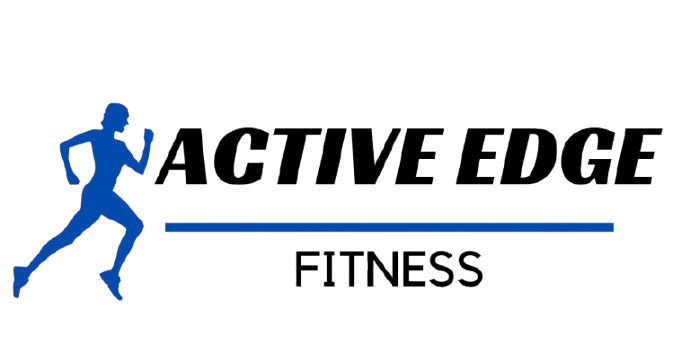

<h1 align="center">Got rice? 🍚</h1>

  <h2><b>Things I'm a part of 🌐</b></h2>
   
  
  
    
  <h2><b>Stuffs I'm proud of 💪</b></h2>
   
  
  
    
  
  <!-- GitHub Stats -->
  <h2><b>GitHub Stats 📊</b></h2>
   
  

